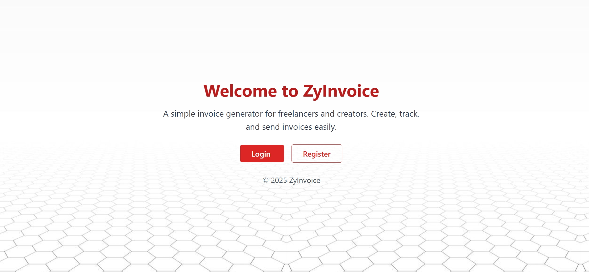
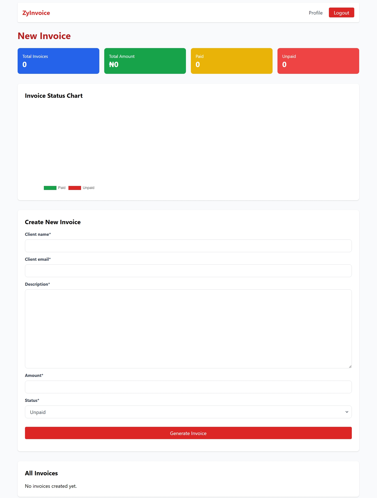

# 🧾 SimpleInvoice

**SimpleInvoice** is a lightweight Django web application that allows freelancers and small business owners to easily generate, manage, and download professional invoices. Designed to be simple, clean, and fast.



---

## 🚀 Features

- ✅ User authentication (Register / Login / Logout)
- ✅ Invoice creation with form validation
- ✅ Dashboard with invoice stats and summary charts
- ✅ Invoice PDF generation
- ✅ View and delete invoices
- ✅ User profile page
- ✅ REST API support (v1.0)

---

## 📸 Screenshots

Invoice Form 

  

---

## 🛠️ Tech Stack

- **Backend**: Django 5
- **Frontend**: HTML, Tailwind CSS
- **Charting**: Chart.js
- **PDF Rendering**: WeasyPrint (or ReportLab)
- **API**: Django REST Framework


## ⚙️ Installation

### 1. Clone the repo

```bash
git clone https://github.com/cruzy-dot/SimpleInvoice.git
cd SimpleInvoice

Set up a virtual environment 

python -m venv venv
source venv/bin/activate  # On Windows powershell: .venv\Scripts\activate.ps1
3. Install dependencies

pip install -r requirements.txt
4. Apply database migrations

python manage.py migrate
5. Create a superuser (admin access)

python manage.py createsuperuser
6. Run the development server

python manage.py runserver
Now open your browser and go to http://127.0.0.1:8000


